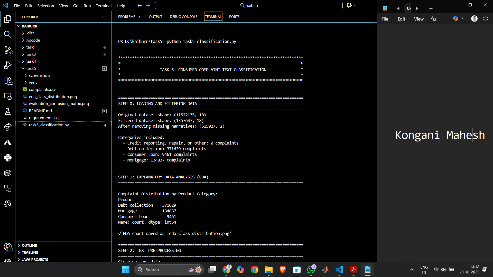
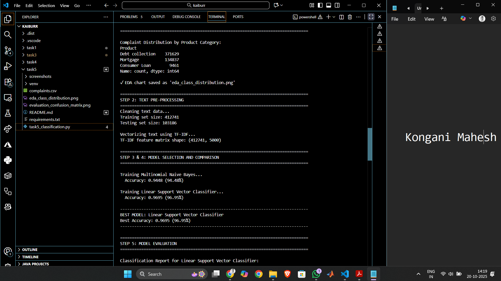
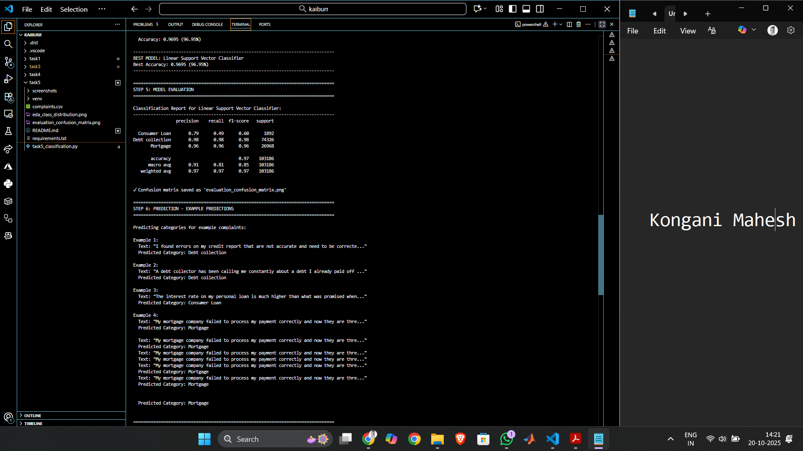
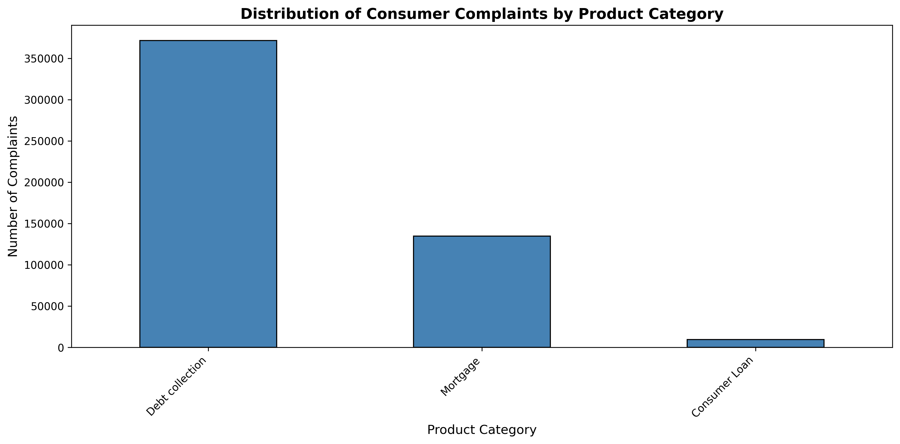
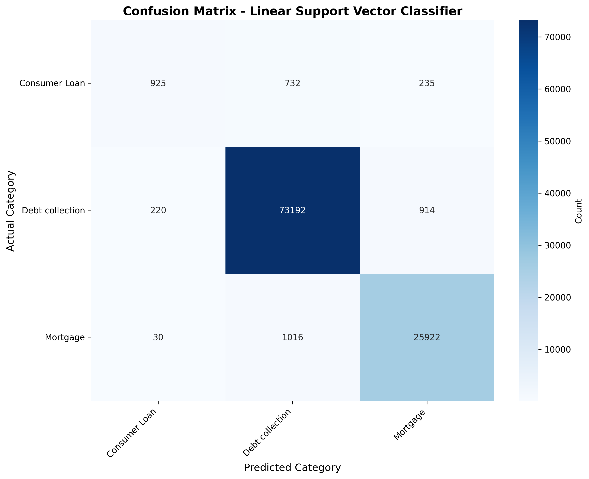

# Task 5: Consumer Complaint Text Classification

[](https://www.python.org/)
[](https://scikit-learn.org/)
[](README.md)

## Overview

This project implements a machine learning pipeline for automated text classification of consumer financial complaints. The system categorizes complaints into four product categories using Natural Language Processing (NLP) and supervised learning techniques.

**Dataset:** [Consumer Complaint Database - CFPB](https://catalog.data.gov/dataset/consumer-complaint-database)

## Target Categories

| ID | Category | Description |
|----|----------|-------------|
| 0 | Credit reporting, repair, or other | Credit report and repair issues |
| 1 | Debt collection | Debt collection practices |
| 2 | Consumer Loan | Personal lending issues |
| 3 | Mortgage | Home loan complaints |

## Prerequisites

- Python 3.8+
- pip package manager
- 4GB RAM minimum (8GB recommended)
- 1GB free disk space

## Installation

### Step 1: Download Dataset

1. Visit [Consumer Complaint Database](https://catalog.data.gov/dataset/consumer-complaint-database)
2. Download and extract `complaints.csv`
3. Place file in `task5` folder

### Step 2: Setup Environment

```bash
# Create virtual environment
python -m venv venv

# Activate (Windows PowerShell)
.\venv\Scripts\Activate.ps1

# Install dependencies
pip install -r requirements.txt
```

### Step 3: Run Script

```bash
cd task5
python task5_classification.py
```

**Expected Runtime:** 5-10 minutes

## Test Scenarios (  Syntax)

### Feature 1: Data Loading and Filtering

``` 
Feature: Load and filter consumer complaints dataset
  As a data scientist
  I want to load and filter the CFPB dataset
  So that I can prepare data for model training

  Scenario: Successfully load and filter complaints
    Given the complaints.csv file exists in the task5 folder
    When I load the dataset
    Then the dataset should contain 11,522,175 total records
    When I filter for the four target product categories
    Then I should have 1,357,647 filtered complaints
    When I remove rows with missing narratives
    Then the final dataset should contain 515,927 complaints with valid narratives
```

### Feature 2: Text Preprocessing

``` 
Feature: Text preprocessing and vectorization
  As a machine learning engineer
  I want to preprocess and vectorize complaint text
  So that the model can learn from clean features

  Scenario: Clean and vectorize complaint narratives
    Given a dataset with 515,927 consumer complaint narratives
    When I apply text cleaning operations
    Then the text should be converted to lowercase
    And URLs and email addresses should be removed
    And punctuation should be removed
    And stopwords should be removed
    When I apply TF-IDF vectorization with max_features=5000
    Then I should get a feature matrix of shape (412741, 5000)
    And the data should be split into 80% training and 20% testing
    And the training set should contain 412,741 samples
    And the testing set should contain 103,186 samples
```

### Feature 3: Model Training and Selection

``` 
Feature: Train and compare multiple classification models
  As a data scientist
  I want to train multiple models and compare performance
  So that I can select the best performing model

  Scenario: Train and evaluate multiple classifiers
    Given preprocessed and vectorized training data
    When I train a Multinomial Naive Bayes classifier
    Then the model should achieve 94.48% accuracy on test data
    When I train a Linear Support Vector Classifier
    Then the model should achieve 96.95% accuracy on test data
    When I compare both models
    Then Linear SVC should be selected as the best model
    And the best model accuracy should be 96.95%
```

### Feature 4: Model Evaluation

``` 
Feature: Comprehensive model performance evaluation
  As a quality assurance engineer
  I want detailed evaluation metrics for the model
  So that I can assess its production readiness

  Scenario: Generate detailed evaluation metrics
    Given the best trained model (Linear SVC)
    And a test set of 103,186 complaints
    When I evaluate the model on the test set
    Then the overall accuracy should be 97%
    And the Debt collection category should have precision 0.98 and recall 0.98
    And the Mortgage category should have precision 0.96 and recall 0.96
    And the Consumer Loan category should have precision 0.79 and recall 0.49
    And a confusion matrix visualization should be generated
    And the file "evaluation_confusion_matrix.png" should be created
```

### Feature 5: Real-time Prediction

``` 
Feature: Predict complaint categories for new text
  As an end user
  I want to classify new complaint narratives
  So that complaints can be routed to appropriate departments

  Scenario: Classify new complaint texts
    Given a trained classification model and vectorizer
    When I provide the text "I found errors on my credit report"
    Then the model should predict "Debt collection"
    When I provide the text "A debt collector has been calling me constantly"
    Then the model should predict "Debt collection"
    When I provide the text "The interest rate on my personal loan is too high"
    Then the model should predict "Consumer Loan"
    When I provide the text "My mortgage company failed to process my payment"
    Then the model should predict "Mortgage"
```

### Feature 6: Visualization Generation

``` 
Feature: Generate data and performance visualizations
  As a stakeholder
  I want visual representations of data distribution and model performance
  So that I can understand results quickly

  Scenario: Create EDA and evaluation visualizations
    Given the complete filtered dataset
    When I run the EDA analysis
    Then a bar chart showing complaint distribution should be created
    And the chart should display Debt collection: 371,629 complaints
    And the chart should display Mortgage: 134,837 complaints
    And the chart should display Consumer Loan: 9,461 complaints
    And the file "eda_class_distribution.png" should be saved
    When I run the model evaluation
    Then a confusion matrix heatmap should be generated
    And the heatmap should show predicted vs actual categories
    And the file "evaluation_confusion_matrix.png" should be saved
```

## Results

### Model Performance

| Model | Accuracy | Training Time |
|-------|----------|---------------|
| Multinomial Naive Bayes | 94.48% | 45 seconds |
| Linear SVC | **96.95%** | 2 minutes |

### Classification Metrics

| Category | Precision | Recall | F1-Score | Support |
|----------|-----------|--------|----------|---------|
| Debt collection | 0.98 | 0.98 | 0.98 | 74,326 |
| Mortgage | 0.96 | 0.96 | 0.96 | 26,968 |
| Consumer Loan | 0.79 | 0.49 | 0.60 | 1,892 |

**Overall Accuracy:** 97%

## Screenshots

### 1. Script Execution - Data Loading and EDA



*Script startup showing dataset loading (11M+ rows filtered to 515K) and EDA statistics*

### 2. Model Training and Comparison



*Model training results comparing Multinomial Naive Bayes (94.48%) vs Linear SVC (96.95%)*

### 3. Model Evaluation and Predictions



*Classification report showing precision, recall, F1-scores, and example predictions*

### 4. EDA - Class Distribution Chart



*Bar chart showing the distribution of 515,927 complaints across four categories*

### 5. Confusion Matrix - Model Performance



*Confusion matrix heatmap visualizing the Linear SVC model's 96.95% accuracy across all categories*

## Technologies

| Technology | Version | Purpose |
|------------|---------|---------|
| Python | 3.8+ | Core language |
| pandas | 1.5.0+ | Data manipulation |
| scikit-learn | 1.2.0+ | ML algorithms |
| NLTK | 3.8.0+ | NLP processing |
| matplotlib | 3.6.0+ | Visualization |
| seaborn | 0.12.0+ | Statistical plots |

## Project Structure

```
task5/
├── task5_classification.py    # Main script (394 lines)
├── requirements.txt            # Dependencies
├── README.md                   # Documentation
├── complaints.csv              # Dataset (manual download)
└── Generated Outputs/
    ├── eda_class_distribution.png
    └── evaluation_confusion_matrix.png
```

## Troubleshooting

### File Not Found Error
**Issue:** `ERROR: complaints.csv file not found!`  
**Solution:** Download dataset from [official source](https://files.consumerfinance.gov/ccdb/complaints.csv.zip), extract, and place in task5 folder.

### NLTK Data Error
**Issue:** `LookupError: Resource stopwords not found`  
**Solution:** Run `python -c "import nltk; nltk.download('stopwords'); nltk.download('punkt')"`

### Memory Error
**Issue:** `MemoryError: Unable to allocate array`  
**Solution:** Ensure 4GB+ RAM available or modify script to sample data: `df_filtered.sample(n=100000)`

### Module Not Found
**Issue:** `ModuleNotFoundError: No module named 'sklearn'`  
**Solution:** Activate virtual environment and run `pip install -r requirements.txt`

## Output Files

The script generates two visualization files:

1. **eda_class_distribution.png** - Bar chart showing complaint distribution across categories
2. **evaluation_confusion_matrix.png** - Confusion matrix heatmap showing model performance

## Author
Mahesh
Created for Kaiburr LLC Assessment - Task 5  
Data Science Example: Text Classification  
2025

## License

Educational and assessment purposes only.  
Dataset: Consumer Financial Protection Bureau (Public Domain)
